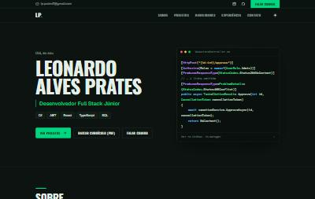
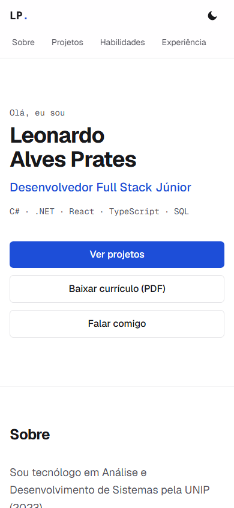
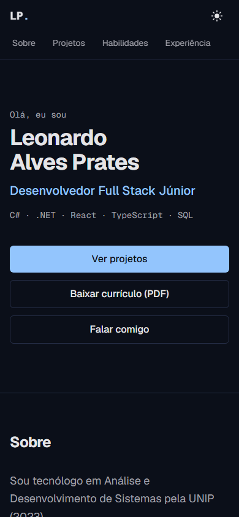

# Leonardo Alves Prates — Portfólio

[](https://github.com/LeopratesDev/portfolio/actions/workflows/ci.yml)

Landing page pessoal de portfólio, em português e inglês.

**🔗 Site: https://leonardo-prates.vercel.app**



| Celular (claro)                                                                                       | Celular (escuro)                                                                                      |
| ----------------------------------------------------------------------------------------------------- | ----------------------------------------------------------------------------------------------------- |
|  |  |

## Lighthouse (mobile, na URL publicada)


Lighthouse 12.8.2, perfil mobile (celular simulado e rede lenta), 3 execuções por página:

| Página | Performance | Acessibilidade | Boas Práticas | SEO | LCP       | TBT      | CLS |
| ------ | ----------- | -------------- | ------------- | --- | --------- | -------- | --- |
| `/pt`  | 97–99       | 100            | 100           | 100 | 2,0–2,2 s | 30–60 ms | 0   |
| `/en`  | 97–99       | 100            | 100           | 100 | 2,0–2,1 s | 30–50 ms | 0   |

Relatórios completos: [`/pt`](docs/lighthouse/mobile-pt.html) · [`/en`](docs/lighthouse/mobile-en.html) (baixe e abra no navegador).

## Em números

- **2 páginas estáticas** (`/pt` e `/en`), geradas no build.
- **158 KB de JavaScript** no navegador (era 232 KB antes da otimização descrita abaixo).
- **47 testes unitários** (Vitest + Testing Library) e **16 execuções E2E** (8 testes Playwright × celular e desktop).
- **0 violações** de acessibilidade no axe (WCAG 2.2 AA) em 16 combinações de idioma, tema, largura e estado do formulário.
- **9 pull requests**, um por etapa, todos com CI verde antes do merge.

## Tecnologias

| Camada     | Tecnologias                                                                    |
| ---------- | ------------------------------------------------------------------------------ |
| Framework  | Next.js 16 (App Router, Server Components, SSG), React 19, TypeScript (strict) |
| Estilo     | Tailwind CSS 4, `next/font` (Geist), `next/image`                              |
| Formulário | Zod (`zod/mini`), Route Handler, Resend (API HTTP)                             |
| Testes     | Vitest, Testing Library, Playwright, axe-core                                  |
| Qualidade  | ESLint, Prettier, EditorConfig, GitHub Actions                                 |
| Deploy     | Vercel (CDN + funções serverless)                                              |

## Funcionalidades

- **Seções:** apresentação, sobre, projetos, habilidades, experiência e formação, contato.
- **Projetos vêm de um arquivo de dados** ([`src/data/projects.ts`](src/data/projects.ts)): adicionar um projeto é adicionar um objeto, sem mexer em componente.
- **PT/EN** com rotas `/pt` e `/en`. A raiz `/` redireciona conforme o idioma do navegador.
- **Tema claro/escuro** que segue o sistema, com escolha salva e sem "flash" ao carregar.
- **Formulário de contato** validado no cliente e no servidor, com proteção contra spam (honeypot + limite de 5 envios a cada 10 minutos por IP). Envia e-mail pelo Resend.
- **SEO:** metadata, Open Graph e Twitter card com imagem gerada no build, `sitemap.xml` com `hreflang`, `robots.txt` e dados estruturados JSON-LD `Person`.
- **Acessibilidade:** HTML semântico, um único `h1`, foco visível, navegação completa por teclado, link "Pular para o conteúdo", `aria-live` nas mensagens do formulário e respeito a `prefers-reduced-motion`.
- **Segurança:** headers (CSP, `X-Frame-Options`, `nosniff`, `Referrer-Policy`, `Permissions-Policy`, HSTS), nenhuma chave no repositório e validação no servidor.

## Como rodar

Pré-requisito: Node.js 22 ou mais novo.

```bash
git clone https://github.com/LeopratesDev/portfolio.git
cd portfolio
npm install
cp .env.example .env.local   # opcional: só necessário para o formulário enviar e-mail
npm run dev                  # http://localhost:3000
```

Sem `RESEND_API_KEY`, o site funciona normalmente e o formulário responde "envio indisponível", com o e-mail direto como alternativa.

| Script                        | O que faz                                                                                               |
| ----------------------------- | ------------------------------------------------------------------------------------------------------- |
| `npm run dev`                 | Servidor de desenvolvimento                                                                             |
| `npm run build` / `npm start` | Build de produção / servir o build                                                                      |
| `npm run lint`                | ESLint (qualquer aviso falha)                                                                           |
| `npm run typecheck`           | Gera os tipos de rota do Next e roda o `tsc`                                                            |
| `npm run format:check`        | Prettier                                                                                                |
| `npm test`                    | Testes unitários (Vitest)                                                                               |
| `npm run e2e`                 | Testes E2E (Playwright, contra o build de produção). Na primeira vez: `npx playwright install chromium` |

A CI ([`.github/workflows/ci.yml`](.github/workflows/ci.yml)) roda lint, formatação, tipos, testes unitários, build e E2E em cada push e pull request.

## Estrutura

```
src/
├─ app/
│  ├─ [lang]/            layout, página e imagem Open Graph por idioma (/pt e /en)
│  ├─ api/contact/       Route Handler do formulário
│  ├─ sitemap.ts, robots.ts
│  └─ globals.css        tokens de cor (claro/escuro)
├─ components/
│  ├─ layout/            Header, Footer, SkipLink, ThemeToggle*, LocaleSwitcher
│  ├─ sections/          Hero, About, Projects, Skills, Experience, Contact
│  ├─ projects/          ProjectCard
│  └─ contact/           ContactForm*
├─ data/                 projects, skills, timeline, profile
├─ i18n/                 pt.json, en.json, config, dictionaries
├─ lib/                  contactSchema, rateLimit, mailer, theme, jsonLd, site
└─ proxy.ts              redireciona "/" pelo idioma do navegador
e2e/                     testes Playwright
```

`*` = Client Components. Todo o resto é Server Component e não envia JavaScript ao navegador.

## Decisões técnicas e trade-offs

**Server Components por padrão.** Só três componentes rodam no navegador: o botão de tema, o formulário de contato e (indiretamente) o React necessário para eles. Seções, cards e navegação são HTML gerado no build.

**SSG (páginas estáticas).** `/pt` e `/en` são geradas no build com `generateStaticParams` e servidas pela CDN. Só a rota do formulário e o redirecionamento de `/` rodam no servidor.

**Tema sem flash, sem estado React.** Um script inline no `<head>` aplica o tema salvo antes da primeira pintura; sem escolha salva, o CSS segue `prefers-color-scheme`. O botão não guarda o tema em `useState`: a fonte da verdade é o atributo `data-theme`, e os ícones trocam por CSS. Assim o HTML do servidor e o do cliente são iguais e não há erro de hidratação.

**i18n sem biblioteca.** Dois idiomas, sem plural nem formatação de datas, cabem em ~60 linhas próprias (dicionários JSON, `getDictionary`, escolha de idioma pelo `Accept-Language`). Um teste garante que PT e EN têm as mesmas chaves. _Trade-off:_ com mais idiomas ou regras de plural, migraria para `next-intl`.

**`zod/mini` em vez do Zod completo.** O mesmo schema valida no cliente e no servidor. O Lighthouse mostrou que o Zod completo colocava ~90 KB no navegador; a versão `mini` tem API em funções soltas que o bundler consegue descartar. Resultado: JS de 232 → 158 KB, TBT de 190 → ~45 ms e Performance de 91 → 97 (medição local).

**Resend via `fetch`, sem SDK.** É uma única chamada HTTP: sem dependência extra e fácil de simular nos testes. O e-mail vai em texto puro (nada do usuário vira HTML) e com `reply_to` de quem escreveu.

**Rate limit em memória.** _Trade-off:_ na Vercel cada instância serverless tem a sua memória, então o limite vale por instância e zera quando ela reinicia. Para um portfólio é suficiente; em escala, usaria um store compartilhado (Redis).

**CSP sem `script-src` estrito.** Uma CSP completa para scripts exigiria nonce por requisição, o que tiraria as páginas do modo estático. A CSP adotada cobre clickjacking (`frame-ancestors 'none'`), `base-uri`, `form-action` e `object-src`. Numa aplicação com login e conteúdo de usuários, usaria nonce.

**Formulário depende de JavaScript.** O requisito era um Route Handler; com Server Actions o formulário funcionaria sem JS. Os links de e-mail, LinkedIn e GitHub ao lado são a alternativa.

**Outros trade-offs assumidos:**

- As âncoras usam os mesmos ids (`#projetos` etc.) nos dois idiomas.
- O currículo existe só em PT; o botão em inglês avisa "(PDF, Portuguese)".
- A página 404 é a padrão do Next (sem tema nem `lang`): personalizá-la exigiria um recurso ainda experimental no Next 16 (`global-not-found`).

## Como os testes foram validados

Além de rodar verdes, os testes E2E foram conferidos quebrando o site de propósito:

- Removendo o `aria-describedby` do formulário, o teste falhou, como deveria.
- Removendo o `scroll-margin-top`, a primeira versão do teste de âncoras **continuou passando** (`toBeInViewport` aceitava o título escondido atrás do header). O teste foi reforçado para medir se o título fica abaixo do header e passou a falhar com a sabotagem.

## Contato

- LinkedIn: https://www.linkedin.com/in/leonardo-prates77/
- GitHub: https://github.com/LeopratesDev
- E-mail: lp.prates7@gmail.com
